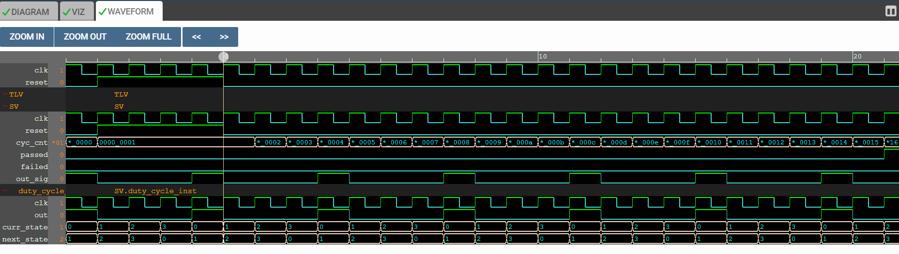

# 25% Duty Cycle Clock Generator with 50% frequency using eSim
### eSim CIRCUIT DESIGN & SIMULATION MARATHON WITH IHP SG13G2

  * [Abstract](#abstract)
  * [Circuit Details](#circuit-details)
  * [Simulation Results](#simulation-results)
  * [Netlist](#netlist)
  * [Conclusion](#conclusion)
  * [Author](#author)
  * [Acknowledgement](#acknowledgement)
  * [References](#references)

## Abstract
This project implements a synchronous 25% duty-cycle clock with 50% of the input clock frequency using Verilog. The output clock is HIGH for exactly one input clock cycle and LOW for three cycles. The design has applications in clock gating, sampling systems, power management, and communication protocols. Simulation of the design is performed using Makerchip IDE integrated inside eSim, and synthesis netlist is generated using Yosys.

## Circuit Details
The circuit is based on a 2-bit counter implemented with two D flip-flops. The outputs of the flip-flops represent the current state, and combinational logic generates the next state. A 4-to-1 multiplexer is used to produce the output HIGH for state 00 and LOW for all other states.  

- Sequential block: 2-bit counter using D flip-flops with asynchronous reset.
- Combinational block: Next-state logic using addition.
- Output block: 4-to-1 multiplexer generating the 25% duty-cycle output.

## Simulation Results
Simulation was done using Makerchip IDE:

## Netlist
Synthesis netlist was generated using Yosys:

The full netlist is included in the project ZIP for reference.

## Conclusion
The project successfully implements a 25% duty-cycle clock generator with 50% frequency in Verilog. Simulation results match the expected waveform, and the netlist has been verified using Yosys synthesis. The design is compact and can be integrated into larger digital systems requiring clock gating or precise sampling control.

## Author
Chinmaya Sharma, chinmaya24163@iiitd.ac.in  
B.Tech. EVE (2024-2028), Indraprastha Institute of Information Technology, Delhi

## Acknowledgement
1. FOSSEE, IIT Bombay  
2. eSim Team, FOSSEE  

## References
US Patent US8442472B2: Technique to generate divide by two and 25% duty cycle  
   [https://patents.google.com/patent/US8442472B2/en](https://patents.google.com/patent/US8442472B2/en)  

